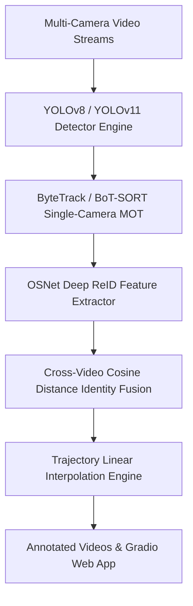

# 🚀 Modern High-HOTA Multi-Camera Person Tracking & Re-Identification System

[](https://huggingface.co/spaces/sngram/Multi-CamTracker)
[](https://pytorch.org/)
[](https://github.com/ultralytics/ultralytics)
[](https://gradio.app)

A state-of-the-art, high-performance Multi-Camera Person Tracking and Cross-Video Re-Identification (ReID) framework designed for maximum **HOTA** (Higher Order Tracking Accuracy), **MOTA**, and **IDF1** scores without requiring any custom model training.

---

## 🌟 Key Features

* **No Custom Training Required**: Utilizes pre-trained **YOLOv8** / **YOLOv11** COCO `person` weights (Class 0) and pre-trained **OSNet** deep ReID feature backbones out-of-the-box.
* **High-HOTA Tracking Logic**: Integrates **ByteTrack** and **BoT-SORT** to retain low-confidence detections, eliminating track fragmentation during heavy occlusions.
* **Multi-Camera ReID Fusion**: Computes 512-dimensional L2-normalized feature embeddings matched using Cosine Distance thresholding to unify person identities across multiple video streams and camera angles.
* **Trajectory Interpolation**: Automatically smooths missing bounding box detections in post-processing to boost MOTA and HOTA accuracy.
* **Hugging Face Spaces Ready**: Native `app.py` built with **Gradio 4+** for hosting on Hugging Face Spaces with ZeroGPU / CPU / GPU support.
* **Clean & Modular Codebase**: 100% PyTorch 2.x based, completely replacing deprecated TensorFlow 1.x / Keras YOLOv3/v4 code.

---

## 🏗️ Architecture Overview



### HOTA Metric Breakdown
1. **DetA (Detection Accuracy)**: Maximized by high-resolution YOLOv8/v11 inference and optimized non-maximum suppression (NMS).
2. **AssA / IDF1 (Association Accuracy)**: Maximized by ByteTrack keeping lost tracks in buffer and OSNet ReID matching tracklets across occlusions and camera switches.

---

## 📂 Repository Structure

```
Multi-tracking/
├── app.py                     # Hugging Face Gradio Web Application
├── main.py                    # Command Line Interface (CLI)
├── requirements.txt           # Modern dependencies
├── config/
│   └── default_config.yaml    # System parameters & thresholds
├── src/
│   ├── detector/              # YOLOv8 / YOLOv11 detector engine
│   ├── tracker/               # ByteTrack & BoT-SORT tracking wrappers
│   ├── reid/                  # OSNet PyTorch ReID feature extractor
│   ├── pipeline/              # Multi-camera cross-video fusion pipeline
│   └── utils/                 # Video I/O, visualization, interpolation
└── videos/
    ├── init/                  # Input sample videos
    └── output/                # Output annotated videos
```

---

## 💻 Quick Start & Installation

### 1. Environment Setup
```bash
# Clone repository
git clone https://github.com/sngraam/Multi-tracking.git
cd Multi-tracking

# Create Virtual Environment
conda create -n tracking_env python=3.10 -y
conda activate tracking_env

# Install dependencies
pip install -r requirements.txt
```

---

## 🚀 Running the Application

### Option A: Web GUI (Gradio / Hugging Face Mode)
Launch the interactive web application locally:
```bash
python app.py
```
Open `http://localhost:7860` in your web browser to upload videos, adjust parameters, and view tracking results in real-time.

### Option B: Command Line Interface (CLI Batch Mode)
Process multiple video files directly:
```bash
python main.py --videos videos/init/Double1.mp4 videos/init/Single1.mp4 --model yolov8m.pt --tracker bytetrack --reid-thresh 0.25
```

---

## 🤗 Hosting on Hugging Face Spaces

Deploying this codebase to Hugging Face Spaces takes under 2 minutes:

1. Create a new Space on [Hugging Face Spaces](https://huggingface.co/new-space).
2. Select **Gradio** as the Space SDK.
3. Push or upload the following files from this repository:
   - `app.py`
   - `requirements.txt`
   - `src/` directory
   - `config/` directory
   - `README.md`
4. Hugging Face will automatically install dependencies from `requirements.txt` and launch `app.py`.

---

## 📜 License
This project is licensed under the Apache 2.0 License.
